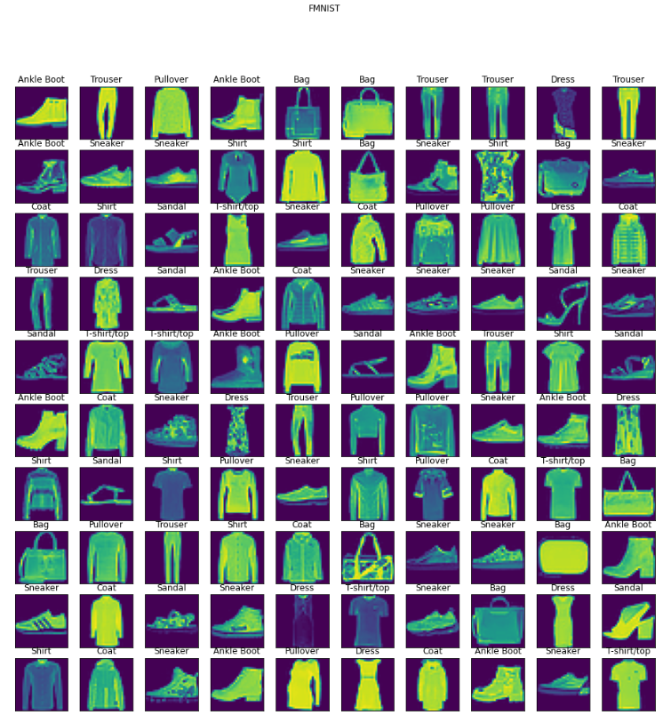
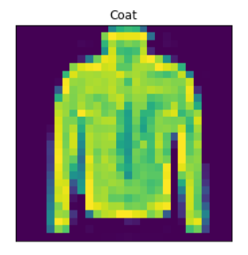

# Fashion MNIST Classification with TensorFlow
In this repository, you'll find a Python script for building and training a machine learning model using TensorFlow to classify images from the Fashion MNIST dataset. This project follows a step-by-step approach to prepare the data, create and train a neural network model, and visualize the results.
<div align="center">

</div>

## Introduction
Fashion MNIST is a popular dataset for image classification tasks. It consists of 60,000 training images and 10,000 testing images, each belonging to one of the following 10 classes:

1. T-shirt/top
2. Trouser
3. Pullover
4. Dress
5. Coat
6. Sandal
7. Shirt
8. Sneaker
9. Bag
10. Ankle Boot

## Getting Started
To run the code, follow these steps:

1. Clone this repository to your local machine:
```bash
git clone https://github.com/AsnaMarzook/Multi-class-Image-Classifier.git
```
2. Install the required libraries:
```bash
pip install numpy pandas tensorflow matplotlib scikit-learn
```

## Data Preprocessing
The code starts by loading the Fashion MNIST dataset using TensorFlow's built-in dataset loader. It inspects the shape and dimensions of the data, and visualizes random images from the dataset to get a sense of the data.
<div align="center">

</div>

## Model Creation
The neural network model is created using TensorFlow's Keras API. The model architecture consists of an input layer, two hidden layers with ReLU activation functions, and an output layer with softmax activation for multi-class classification. You can easily customize the number of hidden layers and units based on your requirements.

## Model Training
The model is compiled with a categorical cross-entropy loss function, the Adam optimizer with a specified learning rate, and accuracy as a metric. It is then trained on the training data for a specified number of epochs. You can adjust the hyperparameters to improve model performance.

## Model Evaluation
After training, the code evaluates the model's performance on the test data. It also computes and visualizes a confusion matrix to understand how well the model predicts each class.
<div align="center">

</div>


